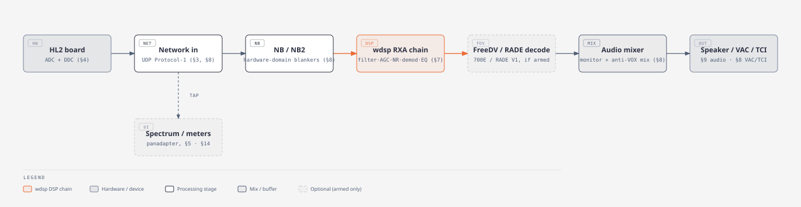
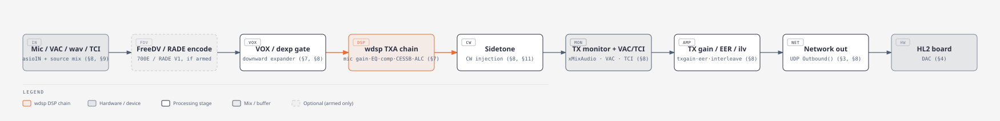

# Thetis Audio Pathway

Where audio actually goes inside Thetis, traced from the source — not just the file list.
Two diagrams: [RX](#rx-audio-pathway) (radio → speaker/VAC/TCI) and
[TX](#tx-audio-pathway) (mic/VAC/TCI → radio). Each node names the real function/file it
comes from and the `code_documentation/CODE_OUTLINE.md` section (`§N`) that documents it in
depth — this page is an orientation map across those sections, not a replacement for them.

Both pathways cross three layers: **ChannelMaster** (`Project Files/Source/ChannelMaster/`,
C/C++) owns the hardware/network edges and the mix points; **wdsp**
(`Project Files/Source/wdsp/`, C) owns the actual DSP chain (`RXA.c`/`TXA.c`); the **Console**
(C#) is where §6/§9/§14 configure both from the UI. See `code_documentation/CODE_OUTLINE.md`
§7/§8 for the full architecture diagrams of those two layers individually.

## RX audio pathway

Traced from `ChannelMaster/cmaster.c::xcmaster` (`case 0`) and
`ChannelMaster/pipe.c::xpipe` (`stream == 0`):

1. **HL2 board** — the radio's ADC/DDC hand the receiver its IQ samples over Protocol-1.
2. **Network in** — `network.c`/`networkproto1.c` receive the UDP stream into `pcm->in[]`.
   (Panadapter/meter taps branch off here — `Spectrum0()`, siphon — before DSP runs.)
3. **NB / NB2** — `xanb`/`xnob` run on the raw IQ, *before* the wdsp chain — the impulse
   blankers work in the hardware domain, not inside `RXA.c`.
4. **wdsp RXA chain** — `fexchange0()` runs `RXA.c::xrxa()`: bandpass/notch, AGC, the NR/NR2/
   NR3/NR4 stack, AM/FM demod, squelch, EQ — the whole receive DSP graph in one call.
5. **FreeDV / RADE decode** *(optional)* — `xfdv()` (FreeDV 700E, inside `xrxa()`, post-AGC)
   or `xradae_rx()` (RADE V1, in `pipe.c`, right after) — both no-ops unless armed.
6. **Audio mixer** — `xMixAudio()` mixes the (possibly decoded) audio into the monitor output
   and any anti-VOX mixers.
7. **Speaker / VAC / TCI** — reaches the operator via the Console's audio device (§9),
   ChannelMaster's VAC engine, or a TCI client (§10).

## TX audio pathway

Traced from `ChannelMaster/cmaster.c::xcmaster` (`case 1`) and
`ChannelMaster/pipe.c::xpipe` (the single-transmitter stream):

1. **Mic / VAC / wav / TCI** — `asioIN()` pulls the audio device, then `xpipe`'s mic-data
   stage mixes in the wav player and VAC/TCI sources.
2. **FreeDV / RADE encode** *(optional)* — `xradae_tx()` replaces the mic audio in place with
   a modem waveform when armed; a no-op otherwise. (700E's TX encoder, `xfdvtx()`, is wired
   inside the wdsp TXA chain itself rather than here — see step 4.)
3. **VOX / dexp gate** — `xdexp()`, the downward-expander/VOX gate, before the DSP chain runs.
4. **wdsp TXA chain** — `fexchange0()` runs `TXA.c::xtxa()`: mic gain, pre-EQ, leveler, the
   Continuous Frequency Compressor, the speech compressor, CESSB overshoot control, ALC,
   AM/FM modulation, PureSignal correction — the whole transmit DSP graph in one call. (This
   is also where the 700E TX encoder, `xfdvtx()`, hooks in — first block in the chain, before
   mic gain.)
5. **Sidetone** — `xsidetone()` injects CW sidetone after the DSP chain runs.
6. **TX monitor + VAC/TCI** — `xMixAudio()` mixes the TX monitor tap; `xvacOUT()`/`xtciOUT()`
   send the same audio to VAC and TCI clients.
7. **TX gain / EER / ilv** — `xtxgain()` (Penelope/amp-protect gain), `xeer()` (envelope
   elimination/restoration), `xilv()` (EER interleave) — final hardware-domain staging.
8. **Network out** — `xilv()` calls `Outbound()`, handing the finished IQ to the UDP send path.
9. **HL2 board** — the radio's DAC turns the IQ stream into RF.

## Notes

- Both pathways are **full duplex and independent** — RX keeps running during TX (for
  monitor/anti-VOX audio) and vice versa; they aren't a single shared chain.
- The **FreeDV/RADE stages are the only conditional steps** in either pathway — everything
  else runs on every RX/TX cycle regardless of mode. See `Documentation/FreeDV-Plan.md` for
  their current status (RX: usable; TX: mechanically proven, not yet on-air-ready — see that
  doc's dated entries for specifics).
- Diagrams generated with the `diagram-design` plugin (architecture type); see
  `code_documentation/AGENTS.md` for the `diagrams/` maintenance convention — redraw if either
  pathway's actual call order changes.

## See also

- `code_documentation/CODE_OUTLINE.md` §6–§9 — the DSP-control, wdsp, ChannelMaster, and
  audio-device sections these pathways cross.
- `Documentation/Thetis_VB-Audio_config.md` — the operator-facing external audio chain (mic →
  interface → Voicemeeter → Thetis VAC → HL2), one layer up from what this page covers.
- `Documentation/FreeDV-Plan.md` — dated progress log for the FreeDV/RADE stages in both
  pathways.
